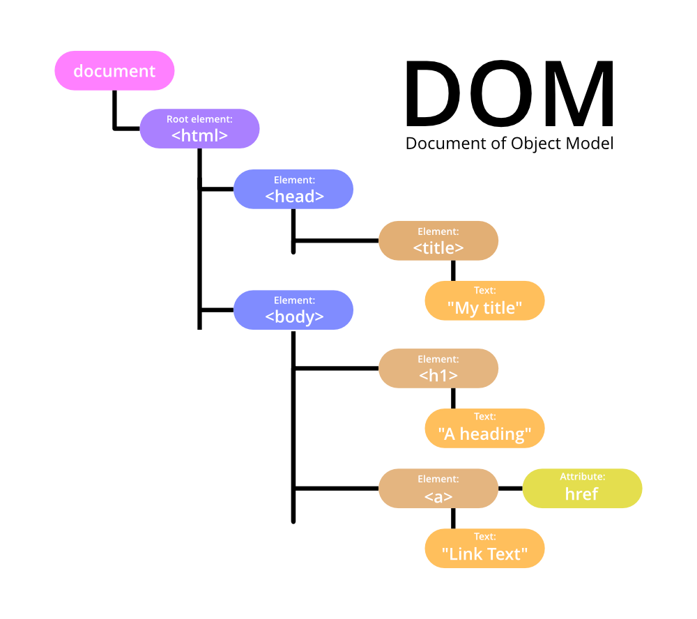

# 📚 **Meaning**
| Language         | Content                         |
| ---------------- | ------------------------------- |
| 🇺🇸 **English** | Tree structure of HTML code     |
| 🇷🇺 **Russian** | Древовидная структура HTML кода |
# 🖼️ **Images**

# ⛓️ **Links**
- [[Why we need DOM]]
# 📥 **Sources**
<iframe src="https://www.youtube.com/embed/SqcY0GlETPk" width="560" height="315" frameborder="0" allowfullscreen></iframe>
# 🏷️ **Tags**
#web #html #dom 